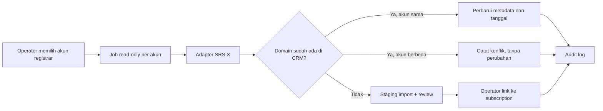

# Rencana Integrasi Domain Registrar SRS-X

## Tujuan

Menambahkan kemampuan mengelola domain yang terdaftar di SRS-X dari BMPnet CRM tanpa mengunci desain aplikasi pada SRS-X. Integrasi harus mendukung dua akun SRS-X, menjaga credential dan EPP code tetap rahasia, serta mengutamakan keselamatan domain pelanggan.

Modul ini adalah **add-on registrar domain**, bukan pengganti modul `SubscriptionDomain` yang sudah ada. Domain yang dikelola registrar lain atau dicatat manual harus tetap dapat dipakai tanpa integrasi API.

## Hasil Studi API SRS-X

Dokumentasi SRS-X menyediakan API untuk:

- cek ketersediaan dan informasi domain;
- registrasi, perpanjangan, transfer, suspend, unsuspend, dan pembatalan domain;
- pembaruan nameserver, contact/WHOIS, transfer lock, ID protection, serta kode EPP;
- managed DNS, DNSSEC, forwarding, dan pengelolaan host/child nameserver;
- user/contact reseller dan informasi saldo/harga reseller.

Registrasi domain menerima `api_id` untuk menghubungkan domain dengan sistem eksternal. Ini dapat diisi dengan identifier transaksi CRM yang tidak sensitif dan unik per permintaan. SRS-X juga menjelaskan bahwa kredensial API dan whitelist IP dikonfigurasi per akun reseller.

Referensi:

- [Katalog API SRS-X](https://kb.srs-x.com/id/api/)
- [Register Domain](https://kb.srs-x.com/id/api/domain/register-domain/)
- [Setting API dan IP whitelist](https://kb.srs-x.com/id/reseller/konfigurasi-reseller/setting-api/)

## Prinsip Keamanan dan Keselamatan Data

1. Tahap pertama hanya read-only: import, sinkronisasi, dan tampilan detail. Tidak ada operasi yang mengubah domain di SRS-X.
2. Tidak ada penghapusan domain dari SRS-X melalui aksi hapus subscription/domain di CRM. Penghapusan lokal hanya memutus relasi integrasi dan menyimpan audit trail.
3. Aksi berbiaya atau sulit dibatalkan, seperti register, renew, transfer, suspend, cancel, perubahan WHOIS, dan DNS, harus memakai konfirmasi eksplisit, permission terpisah, queue, serta audit log.
4. API username, API password, EPP code, auth code, dan payload sensitif disimpan terenkripsi. Nilai asli tidak pernah ditulis ke log, activity log, exception, job payload, atau response browser.
5. Setiap job membawa ID record, bukan credential. Credential dibaca kembali dari database saat job berjalan.
6. Integrasi hanya menerima base URL HTTPS yang diizinkan dan TLS certificate harus diverifikasi. Endpoint resmi global `api.srs-x.com` serta endpoint reseller `srb<angka>.srs-x.com` diterima melalui allowlist ketat; host lain ditolak. API SRS-X harus di-whitelist dengan IP publik server CRM untuk masing-masing akun.
7. Respons provider dipetakan ke status internal; response mentah hanya disimpan ter-redaksi bila diperlukan untuk troubleshooting.

## Desain Add-on Provider

Jangan membuat kode UI/controller langsung memanggil SRS-X. Buat kontrak provider netral berikut:

```php
interface DomainRegistrarProvider
{
    public function capabilities(): DomainRegistrarCapabilities;
    public function testConnection(RegistrarAccount $account): ConnectionResult;
    public function checkAvailability(RegistrarAccount $account, string $domain): AvailabilityResult;
    public function getDomain(RegistrarAccount $account, string $domain): RegistrarDomainData;
    public function listDomains(RegistrarAccount $account, DomainListFilter $filter): CursorPage;
    public function renew(RegistrarAccount $account, RegistrarDomain $domain, int $years): OperationResult;
    public function updateNameservers(RegistrarAccount $account, RegistrarDomain $domain, array $nameservers): OperationResult;
}
```

Struktur yang disarankan:

```text
app/DomainRegistrars/
  Contracts/DomainRegistrarProvider.php
  Contracts/DomainRegistrarCapabilities.php
  DomainRegistrarManager.php
  Srsx/SrsxApiClient.php
  Srsx/SrsxDomainRegistrarProvider.php
  Srsx/SrsxResponseMapper.php
config/domain-registrars.php
```

`DomainRegistrarManager` memilih adapter berdasarkan kode provider (`srsx`, kelak `rumahweb`, atau provider lain). UI membaca `capabilities()` agar tombol yang tidak didukung provider tidak ditampilkan. Provider baru cukup mengimplementasikan kontrak dan mapper; modul domain inti, permission, dan halaman CRM tidak perlu ditulis ulang.

Ini lebih aman daripada plugin executable/dinamis dari pihak ketiga. Pada fase awal, “plugin” berarti adapter internal yang terdaftar eksplisit di konfigurasi dan direview di source code.

## Model Data

### `registrar_accounts`

Satu record untuk satu akun provider. Buat dua record untuk dua akun SRS-X, misalnya `SRS-X Operasional A` dan `SRS-X Operasional B`.

Field minimum:

- `id`, `provider`, `name`, `is_active`;
- `base_url`, `api_username_encrypted`, `api_password_encrypted`;
- `settings_encrypted` untuk konfigurasi provider yang tidak universal;
- `last_tested_at`, `last_synced_at`, `last_error_at`, `last_error_summary`;
- timestamps.

Credential tidak diletakkan pada `.env` global karena ada dua akun dan nantinya dapat bertambah. `.env` hanya boleh menyimpan konfigurasi global yang aman, misalnya timeout API dan mode integrasi.

### Perluasan `subscription_domains`

Pertahankan field lama (`domain_name`, `registrar`, tanggal, `auth_code_encrypted`, catatan) untuk kompatibilitas data lama. Tambahkan:

- `registrar_account_id` nullable FK;
- `provider_domain_id` nullable;
- `provider_status` nullable;
- `provider_metadata` JSON nullable;
- `last_synced_at`, `sync_status`, `sync_error_summary`;
- `managed_by_crm` boolean, default `false`;
- `domain_account_mode` enum `new|existing` nullable (mode saat layanan dibuat, paritas `hosting_account_mode` di `SubscriptionController.php:230`; `new` = registrasi baru, `existing` = tautkan domain SRS-X yang sudah ada).

Domain manual atau provider lain tetap memiliki `registrar_account_id = null`. `registrar` lama dipertahankan sebagai label/presentasi dan dimigrasikan bertahap menjadi nama account/provider jika memang ditautkan.

Domain manual atau provider lain tetap memiliki `registrar_account_id = null`. `registrar` lama dipertahankan sebagai label/presentasi dan dimigrasikan bertahap menjadi nama account/provider jika memang ditautkan.

Tambahkan unique constraint yang aman untuk kombinasi provider dan identifier remote. Normalisasi nama domain ke lowercase sebelum lookup/import. Konflik satu domain yang ditemukan pada dua akun tidak boleh diputuskan otomatis: tampilkan sebagai konflik dan wajib diselesaikan operator.

### Data Operasi

Buat tabel `registrar_operations` untuk permintaan mutasi/asinkron, bukan memakai activity log sebagai sumber status.

- `registrar_account_id`, `subscription_domain_id`, `operation_type`, `status`;
- request/response ter-redaksi, `idempotency_key`, `requested_by`, `approved_by`;
- `started_at`, `completed_at`, `error_summary`.

`Activity Log` tetap mencatat siapa yang meminta/menyetujui/menjalankan aksi, tanpa secret.

## Penanganan Dua Akun SRS-X

Akun dibedakan per **TLD**: Akun A = gTLD (`.com`, `.net`, `.org`), Akun B = ccTLD (`.co.id`, `.my.id`, `.id`). Daftar TLD per akun disimpan di `registrar_accounts.settings_encrypted.allowed_tlds` (JSON array, misal `[".com",".net"]` vs `[".co.id",".my.id",".id"]`). UI menampilkan hint `gTLD`/`ccTLD` pada select akun.

1. Admin membuat dan menguji dua `RegistrarAccount` secara terpisah.
2. Import domain dijalankan per akun dalam mode dry-run terlebih dahulu.
3. Operator meninjau hasil import dan memilih subscription yang benar sebelum link dibuat.
4. Semua operasi domain selalu memakai `registrar_account_id` milik domain, tidak pernah memakai “akun SRS-X default”.
5. Saat mendaftarkan domain baru, admin wajib memilih akun SRS-X. Pilihan tidak otomatis, namun Fase 1 memberi **soft warning** jika TLD tidak cocok dengan `allowed_tlds` akun terpilih (misal `example.co.id` dipilih Akun A → warning `Sebaiknya memakai Akun B ccTLD`). Hard reject dipertimbangkan setelah UAT.
6. Jika domain berpindah akun/provider, gunakan alur relink/migration khusus dengan riwayat. Jangan mengubah `registrar_account_id` langsung dari form edit biasa.

Domain existing pada kedua akun dapat dikelola setelah proses import dan linking selesai. Import tidak membuat domain baru, tidak mengubah nameserver/WHOIS/DNS, dan tidak menghapus domain yang tidak ditemukan. Domain hanya menjadi "tertaut" setelah operator mengonfirmasi pasangan domain remote dengan subscription CRM yang benar.

## Pengaturan dan Aktivasi Modul

Modul harus dapat diaktifkan/dinonaktifkan tanpa menghapus data relasi domain yang sudah tersimpan. Gunakan tiga level pengaturan:

| Level | Pengaturan | Dampak |
|---|---|---|
| Global | `DOMAIN_REGISTRAR_INTEGRATION_ENABLED` | Menonaktifkan seluruh menu, aksi API, scheduler, dan job baru. Data lokal tetap utuh. |
| Provider | provider `srsx` aktif/nonaktif | Menonaktifkan adapter SRS-X sambil tetap membuka jalan untuk provider lain. |
| Akun | `registrar_accounts.is_active` | Menonaktifkan satu akun SRS-X tanpa memengaruhi akun lainnya. Sync dan aksi terhadap akun tersebut ditolak. |

Tambahkan halaman **Sistem > Pengaturan > Integrasi Registrar** untuk pengaturan global non-secret, misalnya mode operasi (`disabled`, `read_only`, `managed`), interval sinkronisasi, batas timeout, dan notifikasi expiry. Nilai global yang sensitif atau deployment-specific tetap berada di `.env`/config dan tidak dapat diubah dari UI.

Halaman **Sistem > Akun Registrar** mengelola akun provider:

- nama akun, provider, base URL, status aktif, dan tombol test koneksi;
- API username/password terenkripsi yang hanya dapat diisi atau diganti, tidak pernah ditampilkan kembali;
- status whitelist/test terakhir, sync terakhir, error aman, dan jumlah domain tertaut;
- tombol import dry-run, review hasil, serta sinkronisasi manual per akun.

Saat mode global `disabled`, halaman dapat tetap menampilkan konfigurasi dan data lokal secara read-only untuk audit, tetapi seluruh panggilan API dan tombol mutasi tidak tersedia. Saat mode `read_only`, hanya test, import, dan sync yang tersedia. Mode `managed` baru dapat diaktifkan Owner setelah fase mutasi lolos UAT.

## Permission dan UI

Tambahkan permission granular, bukan hanya `subscriptions.update`:

- `registrar_accounts.view`, `registrar_accounts.manage`, `registrar_accounts.test`;
- `domains.view`, `domains.sync`, `domains.link`;
- `domains.register`, `domains.renew`, `domains.transfer`, `domains.update_nameservers`;
- `domains.manage_dns`, `domains.manage_contacts`, `domains.view_epp`, `domains.set_epp` (P1 audit: hak melihat EPP terpisah dari hak mengganti EPP).

Rekomendasi role awal:

- Owner: semua permission.
- Admin: view, manage account, test, sync, link, dan aksi operasional setelah approval policy.
- Billing: view domain dan request renew, tanpa akses credential/EPP atau mutasi langsung.
- NOC: view serta update nameserver/DNS hanya bila ditugaskan secara eksplisit.

Halaman yang disarankan:

1. **Sistem > Akun Registrar**: konfigurasi dua akun, mask credential, test koneksi, audit terakhir.
2. **Sistem > Pengaturan > Integrasi Registrar**: status modul, mode operasi, scheduler, dan kebijakan aman non-secret.
3. **Layanan Pelanggan > Detail Domain**: status, expiry, account/provider, nameserver, sinkronisasi, dan riwayat operasi.
4. **Infrastruktur/Domain Registry** (fase lanjutan): inventory lintas customer dan layar import/review konflik.

Credential hanya dapat diisi/ganti, tidak pernah dibaca ulang di UI. EPP/auth code dimask; copy/reveal harus memiliki permission khusus, konfirmasi singkat, dan audit event.

## Tahapan Implementasi

### Fase 0: Validasi Integrasi

- Konfirmasi endpoint produksi, metode autentikasi, format response XML/JSON, rate limit, dan IP whitelist pada masing-masing akun SRS-X.
- Tambahkan feature flag `DOMAIN_REGISTRAR_INTEGRATION_ENABLED=false`.
- Siapkan data uji non-produksi atau satu domain uji yang disetujui.
- Belum ada menu/action mutasi di CRM.

### Fase 1: Fondasi Add-on dan Read-only

- Migration `registrar_accounts`, perluasan `subscription_domains`, dan `registrar_operations`.
- Adapter SRS-X: test koneksi, check domain, info domain, dan list/import inventory jika endpoint mendukung.
- CRUD akun registrar dengan credential terenkripsi dan test koneksi per akun.
- Dry-run import, deteksi conflict, dan proses link manual ke domain subscription yang sudah ada.
- Queue `SyncRegistrarAccountDomains` dan `SyncRegistrarDomain`; semua sinkronisasi idempotent.
- UI layanan domain dengan `domain_account_mode=new|existing` (paritas hosting), select `registrar_account_id` dengan hint gTLD/ccTLD dan soft warning TLD, verifikasi live `getDomain` sebelum link, `managed_by_crm` (`existing=false`, `new` Fase 1 juga `false` read-only).
- Hook notifikasi expiry/sync_failed/conflict ke `Pusat Notifikasi Admin` (`docs/plans/pusat-notifikasi-admin.md`) — tidak ada invoice renew manual.
- Activity log, permission, menu, dokumentasi, unit/feature tests.

**Kriteria selesai:** CRM bisa melihat dan menyinkronkan data dari kedua akun tanpa mengubah apa pun di SRS-X. Invoice renew domain diganti notifikasi `domain_expiry` actionable ke Owner/Admin.

### Fase 2: Operasi Domain Terkontrol

- Tambahkan pembaruan nameserver, WHOIS/contact, lock/protection, dan EPP sesuai capability provider.
- Aksi berisiko memerlukan modal ringkasan perubahan, ketik ulang nama domain sebagai konfirmasi, permission khusus, dan job queue.
- Tampilkan hasil provider serta operasi yang gagal untuk retry aman.
- DNS dikerjakan terpisah dan hanya untuk domain yang secara eksplisit memakai managed DNS SRS-X. CRM tidak boleh menginisialisasi/menimpa DNS otomatis.

**Status: IMPLEMENTASI (2026-08-20) — audit keamanan/retry Fase 2 dituntaskan (2026-08-21), P1 kedua selesai (2026-08-21)**

- **Endpoints SRS-X terkonfirmasi dari KB `kb.srs-x.com`**: `api/domain/info` mengembalikan `startdate`, `enddate`, status, nameserver, dan ID contact; `api/contact/info` membaca detail contact berdasarkan ID tersebut. Selain itu tersedia `api/domain/updatens` (nameserver comma-separated, min 2), `api/domain/getepp`, `api/domain/setepp`, `api/dns/info`, dan `api/dns/edit`. Semua POST form-encoded; `api_id` pada domain operation masih memakai placeholder `1` dan wajib divalidasi saat UAT.
- **Read-only domain detail (2026-08-21)**: `SyncRegistrarDomain` menormalisasi `startdate/enddate` menjadi `registered_at/expires_at`, menyimpan status/ID provider/nameserver, lalu mengambil contact registrant/admin/billing/tech secara read-only. Contact provider disimpan pada `provider_metadata` dan dikecualikan dari Activity Log karena PII. Gagal membaca satu contact tidak menggagalkan sync domain.
- **Capabilities**: `updateNameservers=true`, `manageDns=true`, `viewEpp=true`, `manageContacts=false` untuk **mutasi** contact (belum UAT), `renew=false` (Fase 3), `listDomains=false` (P1 tetap). Pembacaan contact untuk sinkronisasi detail tidak membuka UI/API perubahan contact.
- **Mode gate**: `DomainRegistrarManager::canPerform()` — `read_only` hanya read ops (termasuk `view_epp`, `get_dns`); mutasi (`update_nameservers`, `set_epp`, `manage_dns`) hanya di mode `managed` (SystemSetting `domain_registrar.mode`, default `read_only`). Semua mutasi wajib konfirmasi ketik ulang nama domain di server (`confirm_domain`).
- **Controller** `SubscriptionDomainOperationController` + routes `subscriptions/{subscription}/domains/{domain}/...` (`nameservers`, `epp/fetch`, `epp/set`, `dns/info`, `dns/edit`, `dns/toggle`, `operations/{operation}/retry`) — permission `domains.update_nameservers` / `domains.view_epp` (fetch) / `domains.set_epp` (set + retry) / `domains.manage_dns`. `retryOperation` menyertakan `SubscriptionDomain $domain` (pola konsisten; route param `{domain}` harus ter-bind agar resolusi posisional Laravel 12 tidak salah slot).
- **Jobs**: `UpdateDomainNameservers`, `SetDomainEpp`, `EditDomainDnsRecord` (idempotency `firstOrCreate`, `Cache::lock`, audit `registrar_operations`, notifikasi `domain_operation_failed`). EPP code disimpan `encrypt()` ke `auth_code_encrypted`, tidak pernah di-log.
- **DNS managed opt-in**: kolom `subscription_domains.managed_dns_enabled` (migration `2026_08_20_000008`, default false). Sync/edit DNS hanya untuk domain yang eksplisit enable.
- **Keamanan EPP**: `SetDomainEpp` hanya membawa `operationId`; EPP terenkripsi di `request_secret_encrypted`, dibaca/dekripsi saat job, dihapus setelah sukses. Job serialisasi bebas secret.
- **Retry aman (audit P0/P1)**: retry wajib `confirm_domain`, hanya untuk status `failed`, dan mode + permission diverifikasi ulang per tipe. Controller mengubah operasi secara atomik dari `failed` ke `queued` sebelum dispatch; job hanya melakukan claim atomik `queued -> processing`. Status `processing`, `failed`, dan `completed` selalu di-skip agar job lama tidak dapat mengirim ulang mutasi. `EditDomainDnsRecord` menyimpan payload lengkap agar retry DNS tidak kehilangan `destination`/`ttl`/`priority`.
- **Pemulihan operasi stale (P1 audit, 2026-08-21)**: ...
- **Tests**: `tests/Feature/RegistrarOperationTest.php` (29 test: permission separation ×1, view/set_epp 403, retry ×4, stale recovery ×4 jobs, scheduled ×3, dns ×4, auth ×3) + 8 unit mapper Fase 2 di `SrsxResponseMapperTest`. Full suite `111 passed (237 assertions)`.
- **Belum**: mutasi contact (`domain/updatecontact`) dan lock/protection, register/renew provider (Fase 3), validasi UAT endpoint mutasi produksi (masih gated mode `managed`).

### Fase 3: Register, Renew, dan Transfer

- Register/renew/transfer hanya setelah lifecycle pembayaran disetujui.
- Buat status permintaan: `draft`, `awaiting_payment`, `awaiting_approval`, `queued`, `processing`, `completed`, `failed`, `manual_review`.
- Renewal tidak lagi via invoice manual. Ganti dengan **notifikasi expiry** (`Pusat Notifikasi Admin` `domain_expiry_30/14/7/3/1`, `domain_overdue`) ke Owner/Admin. Petugas Billing request renew (`domains.renew` request → `registrar_operations` `awaiting_approval`), Owner/Admin approve (permission `domains.renew`).
- Transfer dan cancel tetap manual-review pada fase awal karena berisiko terhadap kepemilikan dan availability domain.

#### Fase 3a: Request dan Approval Renew Internal

- **Selesai**: `SubscriptionDomainRenewalController` menyediakan request renew (`domains.renew`) dan approval (`domains.approve_renew`). Request memerlukan konfirmasi ketik ulang domain, durasi 1-10 tahun, dan membuat `registrar_operations` berstatus `awaiting_approval`.
- Approval Owner/Admin mengubah status menjadi `manual_review`, menyimpan `approved_by`, menulis activity log, dan memberi notifikasi ke Owner/Admin saat request dibuat.
- **Batas tegas**: workflow ini tidak membuat invoice, tidak mengantrekan job, dan tidak memanggil SRS-X. Endpoint renew provider tetap belum diaktifkan sampai kebijakan pembayaran dan UAT mutasi domain non-produksi disetujui.

### Fase 4: Billing dan Otomasi Terbatas

- Sinkronkan expiry ke subscription dan buat reminder/invoice sesuai kebijakan bisnis.
- Otomasi renew hanya dipertimbangkan setelah ada saldo/credit policy, approval, grace period, notifikasi, serta rollback/exception handling yang terbukti aman.
- Jangan menjadikan saldo reseller SRS-X sebagai sumber kebenaran akuntansi CRM; hanya tampilkan sebagai informasi operasional terkontrol.

## Alur Sinkronisasi Aman



Tidak ada delete lokal pada hasil sync yang otomatis meneruskan delete ke SRS-X. Bila domain hilang dari hasil provider, tandai `not_found_at`/`manual_review`; jangan hapus record atau status layanan otomatis.

## Queue, Scheduler, dan Observability

- API call berjalan melalui queue dengan timeout, retry terbatas, exponential backoff, dan lock per domain.
- Scheduler awal: sinkronisasi per akun harian; domain dekat expiry dapat disinkronkan lebih sering setelah terbukti stabil.
- Hindari job paralel untuk domain yang sama memakai unique job/lock.
- Simpan error ringkas yang aman untuk UI; detail teknis tetap di Laravel log tanpa credential/payload sensitif.
- Monitoring harus membedakan gagal autentikasi, IP whitelist, provider timeout, response invalid, dan conflict data.

## Testing dan Rollout

1. Unit test mapper response SRS-X untuk success, pending verification, error, dan malformed response.
2. Feature test authorization setiap aksi serta masking credential/EPP.
3. HTTP fake test untuk memastikan secret tidak tertulis pada log/exception.
4. Uji import dua akun dengan domain unik, duplicate, dan domain yang belum memiliki subscription.
5. UAT read-only menggunakan domain test; bandingkan tanggal status/nameserver dengan panel SRS-X.
6. Aktifkan feature flag hanya untuk Owner/Admin pada awal rollout.
7. Fase mutasi harus melalui UAT terpisah, checklist operasi, dan backup database sebelum rilis.

## Keputusan yang Dibutuhkan Sebelum Fase 1

1. Nama bisnis untuk dua akun SRS-X serta pemilik operasional masing-masing (rekom: Akun A = gTLD `.com/.net/.org`, Akun B = ccTLD `.co.id/.my.id/.id`).
2. IP publik CRM yang akan dimasukkan ke whitelist pada kedua akun.
3. Apakah inventory domain akan dimulai dari import semua domain atau hanya domain yang sudah tercatat di CRM.
4. Siapa yang boleh menyetujui register/renew/transfer/cancel (rekom: Owner semua, Admin `manage/test/sync/link/renew`, Billing `view + request renew` tanpa EPP, NOC `view + update_nameservers/manage_dns` — sesuai §Permission).
5. Kebijakan invoice: renew tidak via invoice manual, diganti **notifikasi expiry** ke admin (`docs/plans/pusat-notifikasi-admin.md`). Approver Owner/Admin setelah request Billing (status `awaiting_approval`).
6. Apakah DNS SRS-X akan dipakai untuk sebagian domain; jika ya, daftar domain/NS yang boleh dikelola CRM.

## Keterkaitan dengan Pusat Notifikasi Admin

Notifikasi expiry/sync_failed/conflict/registrar_offline diimplementasikan di `docs/plans/pusat-notifikasi-admin.md`. Domain plan hanya memicu event (`SyncRegistrarDomain` failed, conflict, `expires_at` mendekati) — payload tanpa secret, dedupe harian, CTA sesuai permission.

## Dampak Deployment Awal

Fase 1 akan membutuhkan migration, seeder permission yang additive (tanpa `syncPermissions()` terhadap role production), restart queue worker, dan konfigurasi whitelist IP pada masing-masing akun SRS-X. Tidak ada seeder data domain yang boleh menimpa data existing.
