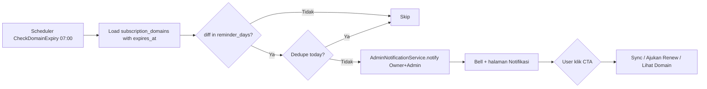

# Rencana Pusat Notifikasi Admin Global dan Actionable

## Tujuan

Membangun pusat notifikasi internal CRM yang global untuk semua modul, menampilkan peristiwa informatif maupun pekerjaan yang membutuhkan tindakan admin/operator. Sistem terintegrasi dengan domain registrar SRS-X, tetapi kontraknya harus dapat dipakai untuk expiry hosting, invoice overdue, payment verification, ticket SLA, infrastruktur, system updates, approval, dan modul baru lainnya.

Modul ini melengkapi `docs/plans/integrasi-domain-registrar-srsx.md` — bukan duplikat. Domain plan tetap fokus pada provider add-on; plan ini fokus pada pipeline notifikasi admin.

Referensi existing:
- Bell dummy di `resources/views/layouts/header.blade.php:127`
- `ClientPortalNotification` (`app/Models/ClientPortalNotification.php:12`) untuk portal client
- `InvoiceReminder` + `SendInvoiceReminders` (`app/Jobs/SendInvoiceReminders.php:24`) sebagai template dedupe dan scheduler
- `SystemSetting` (`app/Models/SystemSetting.php:17`) untuk ambang hari

## Status Implementasi Saat Ini

Fondasi MVP sudah tersedia di kode:

- `AdminNotification` dan migration `admin_notifications`
- `AdminNotificationService` dengan audience Owner/Admin dan dedupe domain
- `AdminNotificationController`, header bell, halaman inbox/detail
- permission `notifications.view` dan `notifications.manage`
- scheduler/job domain expiry, SSL expiry, registrar health, serta prune

Plan ini tidak lagi merencanakan fondasi tersebut dari nol. Prioritas berikutnya adalah generalisasi kontrak, action lifecycle, audience resolver, dan integrasi dashboard.

## Prinsip

1. Notifikasi admin != Activity Log. `activity_log` (Spatie) adalah audit trail read-only (`config/activitylog.php:8`), tidak boleh dipakai untuk reminder. Notifikasi adalah inbox actionable dengan `read_at`, `dismissed_at`, TTL, dan CTA.
2. Notifikasi memiliki mode `informative` atau `actionable`. Notifikasi informative minimal memiliki aksi `Lihat detail` atau `Tutup`; notifikasi actionable memiliki CTA ke modul sumber dengan permission check.
3. Semua notifikasi dihasilkan via queue/scheduler, idempotent (cek `type+payload` + hari), dan tidak mengandung secret (domain, expiry, registrar account name — boleh; EPP/auth code, API password — jangan).
4. Pengiriman default `database` (bell + halaman). `email` opsional via `SystemSetting` dan queue, bukan sync `Mail::send` seperti `TicketNotificationService.php:14`.

## Model Data

### `admin_notifications`

- `id`, `user_id` nullable FK (null = broadcast ke role), `target_role` nullable (misal `Owner|Admin|Billing`);
- `source_type` nullable dan `source_id` nullable untuk identitas entity generik (`Invoice`, `SubscriptionDomain`, `Ticket`, dan seterusnya);
- `type` string stabil (misal `domain_expiry`, `domain_overdue`, `registrar_offline`, `hosting_ssl_expiry`, `invoice_overdue`, `system_update_available`, `ticket_unassigned`); variasi hari disimpan sebagai payload/metadata, bukan tipe baru;
- `category` string (`domain`, `billing`, `ticket`, `infrastructure`, `system`, `approval`);
- `severity` string (`info`, `warning`, `high`, `critical`);
- `action_required` boolean default false;
- `action_key` nullable, resolver server-side untuk menentukan CTA dan route berdasarkan permission;
- `title`, `message`, `payload` JSON nullable (berisi `subscription_id`, `subscription_domain_id`, `registrar_account_id`, `domain_name`, `expires_at`, `days_left`, `error_summary` ter-redaksi);
- `read_at`, `dismissed_at`, `resolved_at`, `resolved_by`, `snoozed_until`, `expires_at` nullable;
- `created_at` indexed, `read_at` indexed;
- index `(user_id, read_at)`, `(type, created_at)`, `(expires_at)`.

`read_at` berarti pengguna sudah melihat notifikasi, bukan pekerjaan selesai. `resolved_at` hanya boleh diisi setelah action modul sumber berhasil. `dismissed_at` menutup notifikasi tanpa menyatakan masalah selesai.

### Notification Type Registry

`app/Services/Admin/NotificationTypeRegistry.php` menjadi single source of truth untuk setiap tipe:

```php
'invoice_overdue' => [
    'category' => 'billing',
    'severity' => 'high',
    'action_required' => true,
    'permission' => 'invoices.view',
    'action_label' => 'Lihat Tagihan',
    'dashboard' => true,
],
```

Registry menentukan metadata, audience resolver, CTA, TTL, channel, dan apakah tipe boleh masuk widget dashboard. Payload tidak boleh menentukan URL secara bebas.

### `SystemSetting` group `notifications`

| key | default | type | deskripsi |
|---|---|---|---|
| `notifications.domain_reminder_days` | `[30,14,7,3,1]` | json | Hari sebelum expiry untuk buat notifikasi (mirip `billing.reminder_days_before [7,3,1]`) |
| `notifications.domain_channel` | `database` | string | `database|email|both` |
| `notifications.hosting_ssl_reminder_days` | `[14,7,3,1]` | json | Untuk `subscription_hostings.ssl_expiry` |
| `notifications.retention_days` | `90` | integer | Auto-prune notifikasi lama |

Seeds via `SystemSettingSeeder` (`database/seeders/SystemSettingSeeder.php:56`), cache 3600s (`SystemSetting.php:54`).

## Jenis Notifikasi (informatif & actionable)

### Domain (terintegrasi SRS-X, Fase 1 read-only)
- `domain_expiry_30/14/7/3/1` — `expires_at - today ∈ reminder_days` dan `registrar_account_id not null` atau `null` (domain manual tetap diingatkan berdasar `subscription_domains.expires_at`). Action: `Lihat Domain` → `subscriptions.show#panelDomain`, `Sync` (`domains.sync`) jika `provider_status` stale.
- `domain_overdue` — `expires_at < today` dan belum `provider_status=expired`. Action: `Ajukan Renew` (request `domains.renew`, bukan eksekusi — sesuai `AGENTS.md:19.3`, entry ke `registrar_operations` status `awaiting_approval`).
- `domain_sync_failed` — `sync_status=failed` setelah `SyncRegistrarDomain`. Action: `Lihat Error` + `Test Koneksi` (`registrar_accounts.test`).
- `domain_conflict` — domain sama ditemukan di 2 akun SRS-X saat import. Action: `Resolve Konflik` (halaman `Domain Registry` Fase lanjutan).
- `registrar_offline` — `last_error_summary` auth/whitelist/timeout. Action: `Test Koneksi`.

### Hosting / SSL
- `hosting_ssl_expiry` — `subscription_hostings.ssl_expiry` 14/7/3/1 hari. Action: `Lihat Hosting` → `subscriptions.show` tab hosting.
- `hosting_provision_failed` — `provisioning_status=failed`. Action: `Lihat Log` (sudah ada di `ServerManageController:99`).

### Billing / Operasional
- `invoice_overdue` — bridge dari `MarkOverdueInvoices:01:00` (selain email `SendInvoiceReminders:08:00`). Action: `Lihat Tagihan`.
- `system_update_available` — `CHANGELOG.md` commit baru dari GitHub. Action: `Lihat Pembaruan Sistem`.
- `ticket_unassigned / high_priority` — opsional, threshold jam.

Setiap tipe membuat **satu notifikasi per hari per payload** (dedupe `where type+payload->domain_name+days_left whereDate created_at = today` seperti `InvoiceReminder.php:77` `exists where invoice_id+reminder_type+days_offset`).

Untuk tipe generik, gunakan `dedupe_key` yang dibentuk dari `type + source_type + source_id + state`. Dedupe harian hanya dipakai untuk reminder berulang seperti expiry. Incident seperti `registrar_offline` sebaiknya membuat satu incident aktif dan hanya membuat reminder ulang berdasarkan kebijakan escalation.

## Audience dan Routing

Audience tidak boleh hanya hardcode Owner/Admin. Resolver harus mendukung user tertentu, role, permission, branch/division, assigned user atau queue, serta broadcast global. Semua penerima tetap diverifikasi ulang saat membaca atau melakukan action.

Contoh: payment verification ke Billing/Finance, ticket NOC ke queue NOC, domain registrar ke Owner/Admin, dan ticket cabang tertentu ke user pada cabang tersebut.

## Desain Layanan

```
app/Notifications/Admin/
  AdminNotification.php (model)
  AdminNotificationService.php (create broadcast, markRead, prune)
  NotificationTypeRegistry.php (metadata, audience, CTA, severity)
app/Jobs/
  CheckDomainExpiry.php (daily 07:00)
  CheckHostingSslExpiry.php (daily 07:15)
  CheckRegistrarHealth.php (hourly, ringan)
```

- `AdminNotificationService::notify(type, source, context)` — resolve registry, audience, dedupe key, metadata, dan payload ter-redaksi; insert per-user agar `read_at` dan `resolved_at` bersifat personal.
- `AdminNotificationService::markResolved(notification, user)` hanya dipanggil setelah action sumber berhasil. `markRead` tidak otomatis menyelesaikan pekerjaan.
- `AdminNotificationService::notifyAdmins(...)` dan `notifyRoles(...)` tetap dipertahankan sebagai compatibility wrapper selama migrasi ke API generik.
- Job `CheckDomainExpiry` membaca `SubscriptionDomain::whereNotNull(expires_at)`, hitung `diffInDays`, `in_array(diff, reminder_days)`, cek dedupe, panggil service. Timeout 300s, `tries=1`, lock `Cache::lock('notifications:domain-expiry', 600)`.
- Semua job bawa ID, bukan secret; secret tidak di-payload notifikasi.

## Permission dan UI

### Permission baru (additive `PermissionSeeder.php:19`, tanpa `syncPermissions`)
- `notifications.view` — lihat bell + halaman `notifications.index`
- `notifications.manage` — `markRead`, `markAllRead`, `dismiss`
- `notifications.settings` — ubah `SystemSetting` group `notifications` (Owner/Admin)

Mapping:
- Owner: semua
- Admin: `view+manage+settings`
- Billing/NOC/CS: `view+manage` (tanpa `settings`)
- Employee/Sales/Finance: `view`

### UI
- **Header bell** `header.blade.php:127` — ganti dummy jadi Alpine fetch `GET /notifications/count` (badge) + dropdown `max-h-[420px]` grup by type, unread bg `#eff6ff` (seperti `client-portal-next/app/notifications/page.tsx:50`), tombol `Tandai semua dibaca`.
- **Halaman `Notifikasi`** `resources/views/notifications/index.blade.php` — filter `type` + `unread`, paginate, CTA per notifikasi (cek `@can('domains.view')` dll), auto-prune badge.
- **Halaman `Pengaturan > Notifikasi`** — reuse `settings/index.blade.php:14` `groupLabels['notifications']` untuk edit `domain_reminder_days` JSON dan `domain_channel`.

### Action UI

- Renderer CTA membaca `action_key` dari registry, bukan URL mentah dari payload.
- Tombol hanya ditampilkan jika user memiliki permission registry dan source entity masih valid.
- Halaman detail tidak menampilkan payload JSON mentah kepada user; gunakan renderer per kategori dan redaksi field sensitif.
- Inbox menyediakan filter `category`, `severity`, `action_required`, `unread`, `unresolved`, dan `source_module`.

## Penanganan Dua Akun SRS-X (TLD)

Akun `A = gTLD (.com/.net/.org)`, `Akun B = ccTLD (.co.id/.my.id/.id)` — disimpan di `registrar_accounts.settings_encrypted.allowed_tlds` (JSON). Saat `domain_account_mode=new|existing`:

- UI `registrar_account_id` select menampilkan hint `gTLD`/`ccTLD`.
- Validasi soft warning (Fase 1) jika `tld(domain_name)` tidak ada di `allowed_tlds` akun terpilih: `ValidationException` dengan pesan `Domain .co.id sebaiknya memakai Akun B`, tidak auto-switch (sesuai `integrasi-domain-registrar-srsx.md:121` manual choose). Fase lanjutan bisa hard reject setelah UAT.
- Import `listDomains` tetap per akun; expiry notifikasi mencakup domain di kedua akun (query `whereIn registrar_account_id [A,B]` + `orWhereNull` untuk manual).

## Alur Notifikasi Domain Expiry



## Queue, Scheduler, dan Observability

- `routes/console.php`:
  ```php
  Schedule::job(new CheckDomainExpiry)->dailyAt('07:00');
  Schedule::job(new CheckHostingSslExpiry)->dailyAt('07:15');
  Schedule::job(new CheckRegistrarHealth)->hourly();
  ```
- Lock per job `Cache::lock('notifications:*', 600)` cegah overlap.
- Log ringkas `Log::info('notifications:domain_expiry', ['sent'=>N])` tanpa payload sensitif.
- Monitoring bedakan `registrar_offline` (401/whitelist/timeout) vs `sync_failed` vs `conflict`.

## Tahapan Implementasi

### Fase 1: Stabilisasi Notification Core
- Dokumentasikan fondasi yang sudah ada, lalu tambah `category`, `severity`, `action_required`, source entity, lifecycle resolved/snoozed, dan registry.
- Pertahankan migration/permission additive; jangan menghapus data lama atau memakai `syncPermissions`.
- Header bell dan halaman inbox menggunakan filter serta action renderer registry.
- Migrasikan dedupe domain/SSL ke `dedupe_key` tanpa mengubah perilaku reminder yang sudah berjalan.
- Activity log tidak dipakai sebagai inbox; tambahkan test authorization, deduplication, redaction, dan resolve lifecycle.

**Kriteria selesai:** Bell menampilkan expiry domain manual & SSL, mark read berfungsi, tidak ada secret di payload.

### Fase 2: Integrasi Domain Registrar SRS-X
- Hook `SyncRegistrarDomain` → on `sync_status=failed` atau `conflict` buat notifikasi `domain_sync_failed`/`domain_conflict`
- Hook `SyncRegistrarAccountDomains` import dry-run → konflik → notifikasi
- CTA `Ajukan Renew` ke `registrar_operations` `awaiting_approval` (Owner/Admin approve per `integrasi-domain-registrar-srsx.md:156` Owner semua, Admin manage, Billing request, NOC view)

### Fase 3: Mutasi & Audit
- Notifikasi `domain_renew_requested` ke approver (Owner/Admin) dengan ringkasan biaya (tanpa saldo SRS-X sebagai sumber akuntansi — `integrasi-domain-registrar-srsx.md:207`)
- Prunejob `retention_days=90` via daily `notifications:prune`

### Fase 4: Integrasi Dashboard dan Modul Baru
- Dashboard widget `Notification Inbox`, `Action Required`, `Operational Health`, dan `Financial Attention` membaca service/query yang sama.
- Tambahkan producer notifikasi untuk payment verification, ticket assignment/SLA, system update, Zabbix/server health, dan approval workflow.
- Setiap producer mendaftarkan `NotificationTypeRegistry`, audience resolver, source entity, dedupe policy, CTA, dan test.
- Tambahkan polling unread count ringan; jangan reload seluruh statistik dashboard.

## Testing dan Rollout

1. Unit test service dedupe (same domain+days → tidak duplikat hari sama, boleh hari beda).
2. Feature test permission bell (`notifications.view` → 200, tanpa → 403).
3. Feature test expiry: buat `SubscriptionDomain` `expires_at = today+7` → jalankan job → `admin_notifications` ter-create dengan payload `days_left=7`.
4. Test TLD warning: pilih Akun A untuk `example.co.id` → validation warning.
5. UAT: bandingkan notifikasi expiry dengan `show.blade.php:681` `expires_at` dan panel SRS-X.
6. Integrasi: notifikasi tidak terlihat jika user tidak memiliki permission sumber; action sukses mengisi `resolved_at`; widget dashboard tidak menampilkan item resolved/dismissed pada queue aktif.

## Keputusan yang Dibutuhkan

1. Apakah `domain_reminder_days` `[30,14,7,3,1]` sudah pas atau perlu `60` untuk ccTLD yang proses renew lebih lama?
2. Channel default `database` saja atau `both` (email ke Owner/Admin)? Rekom `database` dulu (Fase 1), `both` opsional Fase 2.
3. Broadcast ke semua Owner/Admin atau hanya ke penanggung jawab domain (misal per cabang)?
4. Apakah `Action Required` menjadi widget default semua role dengan `notifications.view`? Rekomendasi: ya, tersaring oleh audience dan permission.
5. Apakah reminder escalation memakai email/digest setelah notification core stabil? Rekomendasi: database dulu, email/digest fase lanjutan.

## Dampak Deployment

- Migration `admin_notifications` + seeds `notifications.*`, `permission:cache-reset` (additive, tanpa `syncPermissions`).
- Tidak butuh env baru; `notifications.retention_days` di DB.
- Queue worker harus aktif (`php artisan queue:work`) agar job expiry berjalan.
- Dashboard tidak membutuhkan queue sendiri; queue diperlukan oleh producer notifikasi dan scheduler.
